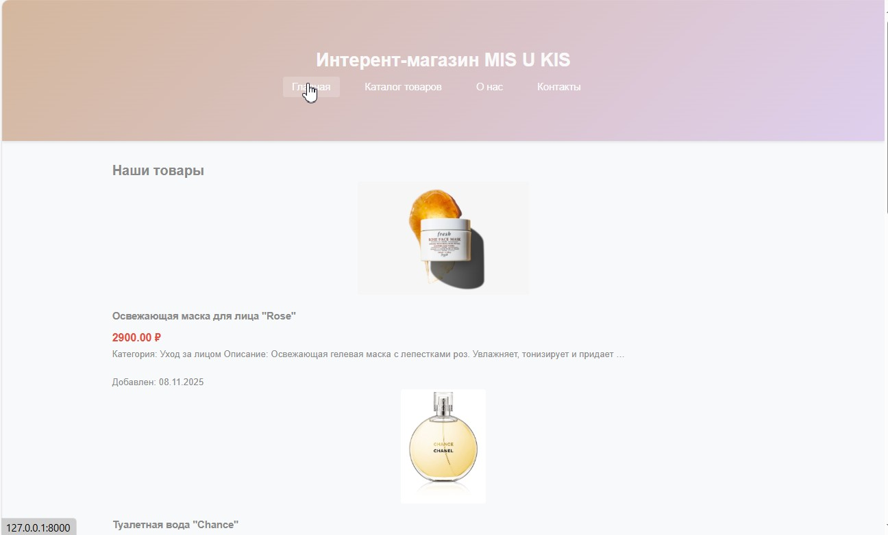

# Internet shop MIS U KIS

## 🛠 Tech Stack


## Описание проекта
Данный проект представляет собой простой интернет-магазин косметики, разработанный на Django. Магазин отображает список товаров и детальную информацию о каждом товаре.

### Главная страница


### Функциональность
**Модель товара** (```Product```) с полями:
```name``` - название товара (CharField)
```description``` - описание товара (TextField)
```price``` - цена товара (DecimalField)
```image``` - изображение товара (ImageField)
```created_at``` - дата создания (DateTimeField)

**Представления:**
```product_list``` - отображает список всех товаров
```product_detail``` - отображает детальную информацию о товаре

**Шаблоны:**
```base.html``` - базовый шаблон с общим стилем (хэдер и футер)
```product_list.html``` - список товаров (наследуется от base.html)
```product_detail.html``` - детальная информация о товаре (наследуется от base.html)

**Статические файлы:**
CSS-стили для улучшения внешнего вида
Адаптивный дизайн

**Дополнительно реализовано:**
Наполнение магазина 5 косметическими товарами через Django Administration
Категории товаров (уход за лицом, декоративная косметика, уход за волосами, уход за телом, парфюмерия)
Фильтры Django для форматирования цены и текста
Обработка случая, когда товар не найден

**Особенности реализации**
Наследование шаблонов для избежания дублирования кода
Использование фильтров Django для форматирования данных
Статические файлы для стилизации
Обработка ошибок (404 при отсутствии товара)
Адаптивный дизайн для мобильных устройств

## Установка и запуск

### Активируйте виртуальное окружение:
```
bash
python -m venv venv
source venv/bin/activate  # для Linux/MacOS
venv\Scripts\activate     # для Windows
```
### Установите зависимости:
```
bash
pip install django pillow
```
### Примените миграции:
```
bash
python manage.py makemigrations
python manage.py migrate
```
### Создайте суперпользователя для доступа к админке:
```
bash
python manage.py createsuperuser
```
### Запустите сервер:
```
bash
python manage.py runserver
```
### Добавьте товары через Django Administration:

Перейдите по адресу: ```http://127.0.0.1:8000/admin/```
Войдите с данными суперпользователя
В разделе "Products" добавьте товары